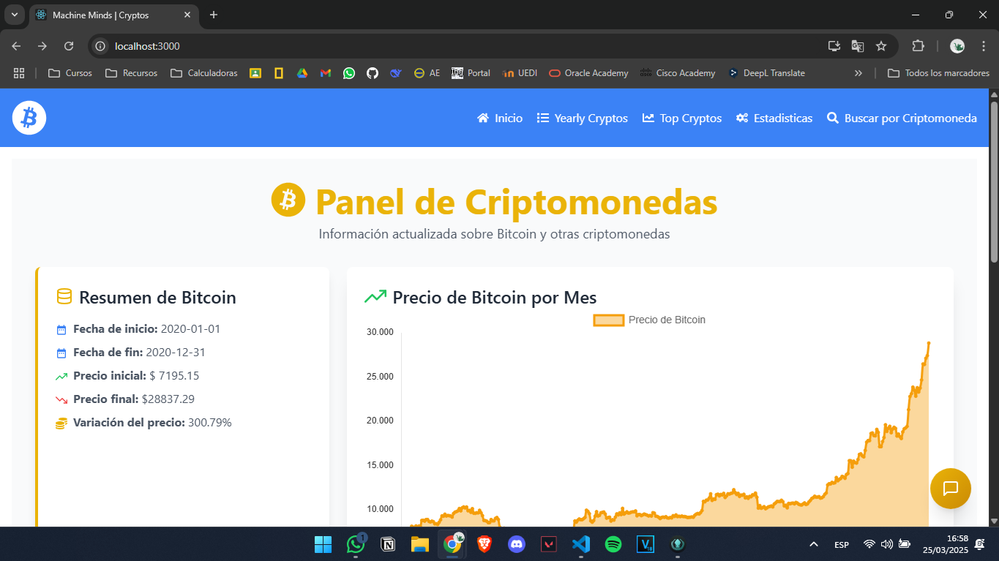
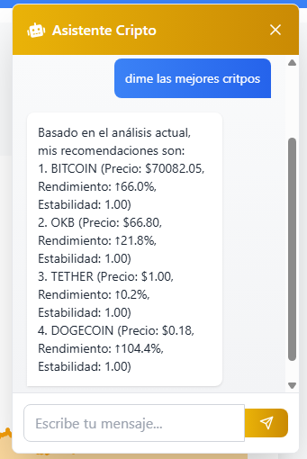
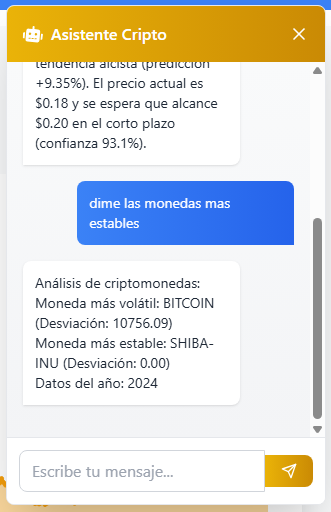

# CryptoVision Analytics

## 🌟 Plataforma Inteligente de Análisis Cripto

**CryptoVision** es una solución completa que combina visualización de datos con inteligencia artificial para ofrecer insights accionables sobre el mercado de criptomonedas.

### 🔍 Características Clave

#### 🤖 Asistente Virtual Cripto Inteligente
Nuestro chatbot especializado puede responder a consultas como:
- Consultas de precios: _"¿Cómo está el Bitcoin hoy?"_
- Recomendaciones: _"¿Qué criptomonedas recomiendas este mes?"_
- Análisis técnico: _"¿Es buen momento para comprar Ethereum?"_
- Volatilidad: _"¿Cuáles son las monedas más estables?"_

#### 📊 Dashboard con Insights Generados por IA
- **Recomendaciones automatizadas** basadas en:
  - Análisis de tendencias
  - Agrupamiento inteligente
  - Identificación de patrones de mercado
  
  *Recomendaciones generadas automáticamente con modelos de machine learning*

#### 📈 Herramientas de Análisis
- Visualización histórica interactiva
- Comparación entre múltiples activos

## 🖥 Demostración del Sistema

### Interacciones con el Asistente Virtual

1. **Consultas de Precio**  
     
   *El asistente proporciona valores actualizados con precisión*

2. **Recomendaciones Inteligentes**  
     
   *Sugerencias basadas en análisis técnico*

3. **Análisis de Tendencias**  
     
   *Predicciones de comportamiento de mercado a corto plazo*

4. **Comparación de Volatilidad**  
     
   *Identificación de activos estables vs. volátiles*

### Dashboard de Recomendaciones IA

 
*Resultados generados por nuestros modelos de inteligencia artificial mostrando:*
- Criptomonedas con mayor potencial
- Predicciones de precios

## Tecnologías Clave
- **Procesamiento de Lenguaje Natural** para comprensión de consultas
- **Algoritmos K-Means** para agrupamiento de criptoactivos
- **Visualización interactiva** con librerías modernas
- **Pipeline de datos automatizado** para análisis en tiempo real
